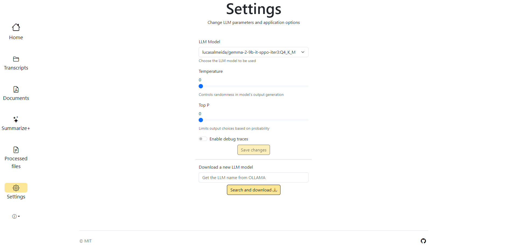

# SmartMinutes

This project is a complete system for summarizing, and extracting relevant information from meetings using **Large Language Models (LLMs)** running locally. The system supports auxiliary documents to enhance Meeting Minutes accuracy by employing the **Retrieval-Augmented Generation (RAG)** technique. The source code freely available under the [MIT license](LICENSE.md).

The project is divided into two main components:
- **Backend**: Handles transcription processing, summary generation, and AI model integration.
- **Frontend**: A simple and efficient static web interface that allows users to upload transcriptions, view summaries, transcriptions and manage auxiliary documents.

## 🖥️ Hardware Requirements

The system has been tested on the following hardware configuration, and a similar setup is recommended for optimal performance:
- **Processor**: AMD Ryzen 5 3600 or higher;
- **RAM**: 16GB (minimum);
- **Graphics card**: RTX 3060 12gb;
- **Storage**: NVMe SSD recommended with at least 15GB of free space;

## 🛠️ Software Requirements 

Before running the project, ensure the following dependencies are installed: 
- **Operating System**: Linux (tested on Ubuntu 22.04) or Windows 10
- **Python**: Version 3.11 or later 
- **Ollama**: Required for running LLMs locally, version 0.3.12  ([Installation Guide](https://ollama.com/))

## 📖 Documentation

The full project documentation is available in the docs/ folder. It includes:

- **System Overview**: Architecture and main functionalities.
- **API Reference**: Endpoints and usage examples.

To view the documentation, navigate to the docs/ folder:
: 
API Reference: 

### 🔽 Downloading the LLM

The project is optimized for **gemma-2-9b-it-sppo-iter3**, which can be downloaded via Ollama with the following command: 

``` bash
# Downloads the LLM model by using Ollama
ollama pull lucasalmeida/gemma-2-9b-it-sppo-iter3:Q4_K_M
```

### 🚀 Quick Start
#### 1. Clone the Repository

``` bash
git clone https://github.com/lucasandre22/smart-minutes.git
```
#### 2. Backend Setup

Navigate to the backend directory and create a virtual environment:

``` bash
cd backend
python3 -m venv venv
source venv/bin/activate  #On Windows: venv\Scripts\activate
pip install -r requirements.txt
```

Run the backend server:

``` bash
uvicorn api.main:app --host=0.0.0.0 --port=8000
```

If preferable, run the backend server with Hot Reload:

``` bash
uvicorn api.main:app --host=0.0.0.0 --port=8000 --reload
```

#### 3. Frontend Setup
Just kidding, there are no action to be taken to setup the frontend :).

The application should now be accessible in your browser at `http://localhost:8000`.


### 📂 Project Structure
```bash
├── backend/            # Backend service (FastAPI, LLM processing, RAG)
│   ├── action_items/   # All the classes related to the action items feature
│   ├── api/            # Classes related to the FastAPI
│   ├── core/           # config.py file and RAG database loading method
│   ├── custom_request/ # Classes related to the Custom Request feature
│   ├── databases/      # Where all the files consumed by the system are stored, like transcripts (Created when starting the project for the first time)
│   ├── llms/           # The standard LLM classes, used through the code
│   ├── minutes/        # Classes related to the Meeting Minutes method
│   ├── rag/            # Classes related to RAG
│   ├── scripts/        # File parsers scripts
│   ├── summarization/  # Classes related to the Summarization method
│   ├── tests/          # Test classes
├── frontend/           # Frontend application (Bootstrap)
│   ├── assets/         # UI assets (icons)
│   ├── css/            # CSS Stylesheets file
│   ├── js/             # Javascript files
│   └── *.html...       # Static HTML pages
├── docs/               # Documentation and design assets
└── README.md           # Project documentation
```

### 🔧 Configuration

You can configure environment variables in a `backend/core/config.py` file for backend, including API keys and model settings.

Also, you can navigate to the settings page in the applications and configure:



### 📌 Features

✅ AI-powered summarization, action items, meeting-minutes and custom requests about the meeting
✅ Support for external documents (RAG) 
✅ Local LLM execution (no external API costs)  
✅ Web-based user interface
### 🤝 Contributing

Feel free to submit issues, pull requests, or suggestions to improve the system!