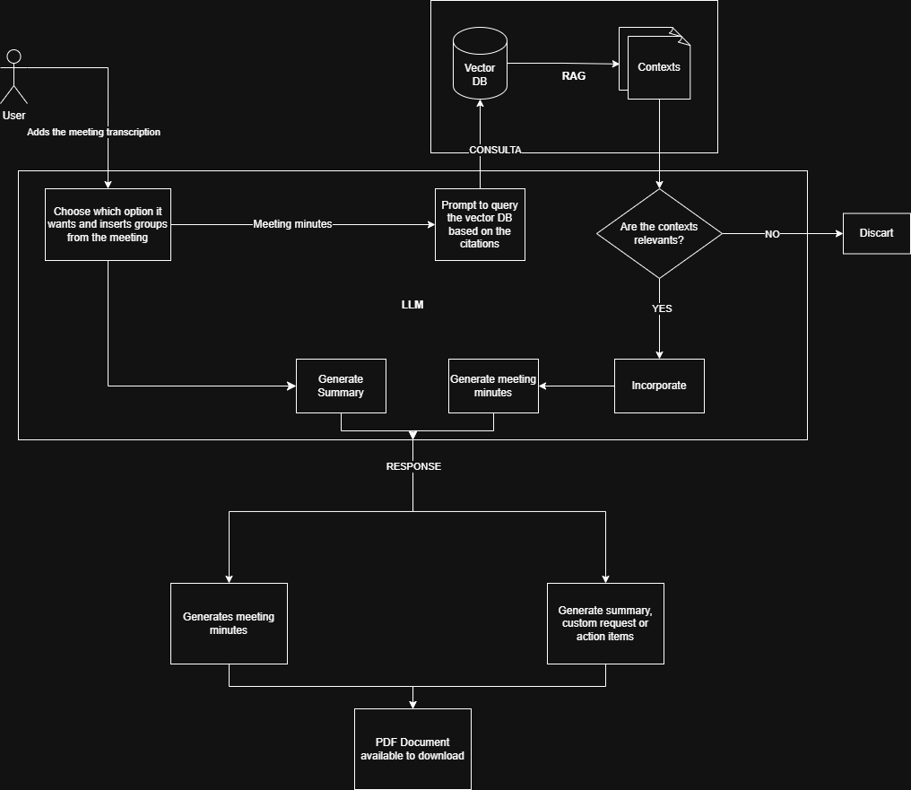

# 🏗️ System Architecture

This project follows a very simple **architecture**, where every module in `backend` follows a structure easy to understand. Once the structure is understood, it is possible to understand the rest of the code and its modules.

## System high level architecture

The following diagram demonstrates the System's high level architecture:

