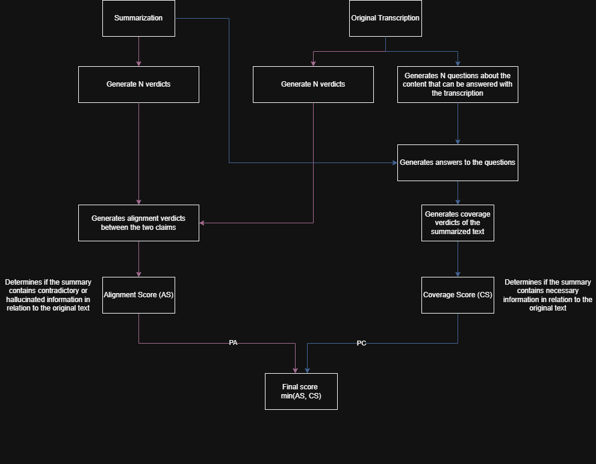

# 📊 Evaluation Framework for Summarization Quality 

This module provides an **evaluation framework** to assess the quality of meeting summaries generated by the system. It leverages **[DeepEval](https://github.com/recognai/deepeval)** to perform automatic evaluations based on predefined quality metrics.

## Evalluation workflow

The following diagram demonstrates the evalluation workflow:

