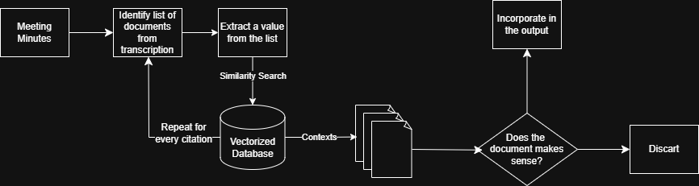

# 🔍 Understanding Retrieval-Augmented Generation (RAG)

## 📌 What is RAG?

**Retrieval-Augmented Generation (RAG)** is a technique that enhances Large Language Models (LLMs) by incorporating **external knowledge retrieval**. In the context of this project, the external knowledge can be documents, manuals, laws, etc.

Instead of relying solely on pre-trained knowledge, RAG retrieves **relevant documents** from a vector database (FAISS) and uses them to **generate more accurate and context-aware responses**.

## ⚙️ How Does RAG Work?

The RAG process follows these main steps:

1️⃣ **User Query** → The system receives an input query.
2️⃣ **Document Retrieval** → A vector database (FAISS) finds relevant documents based on semantic similarity.  
3️⃣ **Context Injection** → The retrieved documents are provided as context to the LLM.
4️⃣ **Response Generation** → The LLM generates a response.

## 🏗️ Why Use RAG?

✅ **Improves Accuracy** – Uses external knowledge to enhance responses.  
✅ **Reduces Hallucinations** – The model grounds its output in real, verifiable data.  
✅ **Dynamic Knowledge Updates** – New information can be added without retraining the LLM. 

## SmartMinutes RAG workflow

The following diagram demonstrates the RAG workflow in the context of the system:

